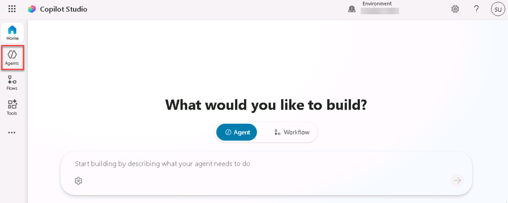
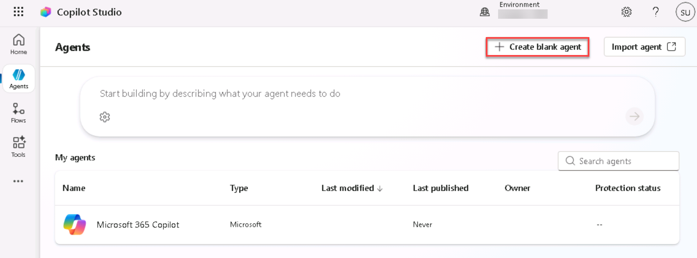

# 1 - Build your agent

@lab.Activity(Automated3)

To start, you're going to setup the foundation for your agent in Copilot Studio.

1. Open Microsoft Edge and navigate to

    <!-- markdownlint-disable-next-line MD034 -->
    +++https://copilotstudio.microsoft.com+++

    

1. Log in with

    <!-- markdownlint-disable-next-line MD034 -->
    **Username:** +++@lab.CloudCredential(CSBatch1).Username+++

    <!-- markdownlint-disable-next-line MD034 -->
    **Temporary Access Password:** +++@lab.Variable(TAP)+++

    > [!NOTE]
    > If the Temporary Access Password isn’t showing up, select the button on the top of this page that says **Refresh Credentials**

1. After logging in, you'll see a message letting you know it's configuring your developer environment. Wait until that finishes (shouldn't take more than a minute)

    

1. If you see a welcome screen like is shown below, select the country/region that you’re in from the dropdown and select **Get Started**

    

1. If you see a welcome message as shown in the screenshot below, select **Skip**.

    

1. In the left nav click **Agents** button to start creating a new agent

    

1. Select **Create blank agent**

    

    > [!NOTE]
    > It could take a minute or two for the agent to fully configure. You'll see a message that says your agent is provisioned when it's ready.

1. In the name field, type +++Zava Order Support+++ and then click the **Create** button

    

1. Now you need to equip your agent with knowledge so it can answer questions about the company, shipping policies, etc. To do this, in your agent overview screen, scroll down to the knowledge section and select the **Add Knowledge** tab.

    

1. Click the **select to browse** button and navigate to **D:\LabFiles\KnowledgeDocuments**. Select the **zava_faq**, **zava_returns_shipping_policy and warranty_policy documents**.

    

1. Verify the files are added then select **Add to Agent**

    

1. You'll know your files are ready to use when you see the **Ready** checkbox next to each file.

    

    > [!NOTE]
    > The process of uploading the files can take 5 - 20 minutes to complete. You can continue on to the next steps while the files are processing. The files must show **ready** status before you can properly test the agent.

    Don't worry if it looks like the following screenshot. Please continue the lab, we'll come back to this later.

    

1. Now we need to tell the agent what it's supposed to do. To do this, scroll up to the **Instructions** section and select the **Edit** button and paste in the following instructions:

    ```text
    Your job is to help customers with Zava’s policies, product FAQs, shipping, returns, and general company info. Use only the supplied knowledge documents. Your behavior: Always consult the Knowledge sources (FAQ, Returns & Shipping Policy) for answers to customer questions in those domains. When you answer, provide a citation (which document and section) whenever possible. If the user asks about something not in the knowledge bases, reply with: “I’m sorry, I don’t have that info yet. Can I help with something in our policy or FAQ?” Use a friendly, professional tone. Be clear but avoid any technical jargon unless user knows them. Keep answers focused and concise. Break up longer responses with bullet lists or numbered steps if helpful.
    ```

    Click **Save**

    

1. Before we test to make sure the agent is following our instructions and pulling from our knowledge sources, we need to configure some settings. To do this, select the **Settings** button in the upper right hand corner.

    

1. Scroll down to find the **Knowledge** section. The default behavior for all agents created in Copilot Studio is to allow the agent to use general knowledge from the model that it's using and information from the Web. While this is great if you want your agent to be able to handle chit-chat type scenarios, if you only want your agent to use the knowledge sources and tools you provide it with to answer questions, having these settings on could potentially lead to hallucinations. Depending on your use case, you might want to disable these settings. Since we want our agent to only use data from the knowledge sources we provide to answer questions, we will toggle the **Allow ungrounded responses** setting and the **Use information from the Web** to **Off**.

    

1. Click the **Save** button at the bottom of the screen and select the **X** button in the upper right hand corner to close out of the settings screen.

    

Congratulations! You have setup an agent that can answer questions about static data from files! We will test it out to make sure it's working in future steps to allow more time for the files to process. Next ,we'll integrate it with an MCP server.
