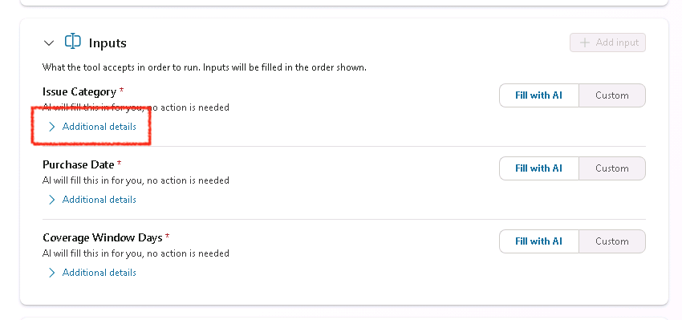
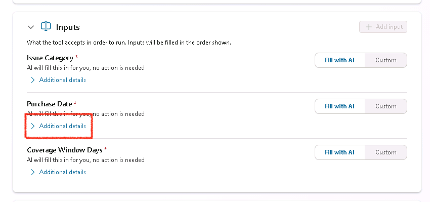
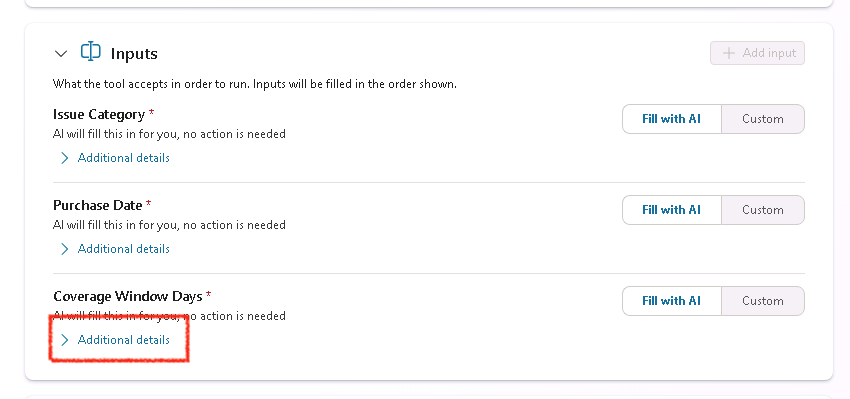

# 4 - Add an Agent Flow for Approving Warranty Claims

Now that we have an AI prompt that can classify warranty claims and extract key info, we’re going to wrap this process in a formal, approval path based off of certain conditions like if it's in the warranty period. This is exactly what Agent Flows are for: augmenting your agents with a configurable and predictable decision path. In this section, you’ll build an agent flow that reads the extracted fields, evaluates the policy conditions, and triggers an auto approval if those conditions are met.

1. Select **Overview** to get back to the overview of the agent

1. To create a new agent flow, scroll down to the Tools section and select **Add Tool**
    

1. Select **Agent Flow**. This will route you to a new agent flow that you'll need to configure.

    

1. You'll see two items on the screen, the trigger which kicks off the flow and the response which returns data back to the agent. The first thing we need to do is configure any inputs that we want to pass into our flow from the agent to use in the flow. To add these inputs, select the **When an agent calls the flow** trigger.

    

1. Select **Add an input**

    

1. Select the **Text** option

    

1. In the Text input type ```Issue Category```

    

1. Select **Add an input**

    

1. Select the **Text** option

    

1. In the Text input type ```Purchase Date```

    

1. Select **Add an input**

    

1. Select the **Number** option

    

1. In the Text input type ```Coverage Window Days```

    

1. Select the **When an agent calls the flow** trigger again to collapse the inputs

1. Select the **plus button** between the when an agent calls a flow and respond to agent to add a new action.

    

1. Search for ```variable``` and select **initialize variable**

    

1. In the **Name** field type ```Approval Outcome```. And in the **Type** dropdown select **String**.

    

1. Select the **plus button** again below the initialize variable action you just added

    

1. Search for ```variable``` and select **initialize variable**

    

1. In the **Name** field type ```Approval Message```. And in the **Type** dropdown select **String**.

    

1. Select the **plus button** again below the initialize variable action you just added

    

1. Search for ```variable``` and select **initialize variable**

    

1. In the **Name** field type ```Days Since Purchase```. And in the **Type** dropdown select **Integer**.

    

1. In the **Value** Input of the Initialize Variable, select the **Fx** Button.

    

1. In the expression textbox, paste the following expression.

    ```text
    sub(int(div(sub(ticks(utcNow()), ticks(triggerBody()?['text_1'])),864000000000)),0)
    ```

1. Verify the formula is added to the expression box and select the **Add** button

    

1. Verify the expression shows in the value input as shown below.

    

1. Click the **Plus Button** below the initialize variable.

    

1. Search for ```condition``` and select **Condition** under the control header.

    

1. Now we need to fill out the conditions we want to check for. To do that, click in the first input and select the **lightning bolt** icon

    

1. Select the **Days Since Purchase** variable

    

1. Select the **is less or equal to** dropdown

    

1. In the right text box select the **lightning bolt** icon.

    

1. Select the **Coverage Window Days** Input

    

    Your condition should look like the screenshot below. We need to add one more condition to this.

    

1. Select the **lightning bolt** icon in the left text input

    

1. Select the **Issue Category** input.

    

1. Change the condition dropdown to **is not equal to**

1. In the right text input type ```Unknown```. Verify that your Condition action matches the screenshot below.

    

1. Now that we have our conditions we want to check for, we need to tell the flow what would happen if it meets those conditions and what to do if it doesn't. To do this, expand out the **True** dropdown and select the **Plus button**

    

1. Search for ```variable``` and select the **Set Variable** action.

    

1. In the **Name** Dropdown select the **Approval Outcome** variable.  In the **Value** input type ```Auto-Approved```. What we're doing here is for our process, we want to auto-approve any warranty claims that aren't unknown category and are within the coverage window.

    

1. Now we want to fill in the approval notes. To do this, expand out the **True** dropdown and select the **Plus button**

    

1. Search for ```variable``` and select the **Set Variable** action.

    

1. In the **Name** Dropdown select the **Approval Message** variable.  In the **Value** input type ```The Warranty Claim has been reviewed and meets all requirements to be auto-approved.```

    

1. Now we need to tell the flow what to do if it doesn't meet these conditions. To configure this, expand the **False** section and select the **Plus Button**

    

1. Search for ```variable``` and select the **Set Variable** action.

    

1. In the **Name** Dropdown select the **Approval Outcome** variable.  In the **Value** input type ```Needs Exception Approval```. This will return back to the user informing them it couldn't be auto-approved and escalation is needed

1. Now we want to fill in the approval notes. To do this, select the **Plus button** in the false condition right below the set variable you just added.

    

1. Search for ```variable``` and select the **Set Variable** action

    

1. In the **Name** Dropdown select the **Approval Message** variable.  In the **Value** input type ```The Warranty Claim has been reviewed and it is not within the approved warranty policy guidelines. You can request a review for an exception if you'd like.```

    

1. We are in the home stretch now. All that's left is to pass the data of the approval outcome back to the agent. To do that, scroll to the bottom and click to expand the **Respond to the agent** action and select the **Add an output** button

    

1. Select **Text** for the output type

    

1. Type ```Approval Outcome``` in the left text box. Click in the right text box and select the **lightning bolt** icon

    

1. Select the **Approval Outcome** variable

    

1. Select **Add an Output** again

    

1. Select **Text** as the Output Type

    

1. Type ```Approval Notes``` in the left text box. Click in the right text box and select the **Lightning bolt** icon.

    

1. Select the **Approval Message** variable

    

1. Select the **Flow Checker** button to test your flow for errors and ensure no errors are found.

    

1. Select the **Save Draft** button

    

1. Select the **Overview** button in the top navigation

    

1. Select the **Edit Button** in the Details section

    

1. Change the **Flow Name** to:

    ```text
    Auto Approval Claims
    ```

1. In the **Description** input, type:

    ```text
    This agent flow evaluates a warranty claim against a condition to determine if it's eligible for auto-approval or needs escalation and returns a response to the agent.
    ```

1. Click the **Save** button.

    

1. Select the **Designer** tab in the top navigation to go back to the designer view.

    

1. Select the **Publish** button

    

1. Select the **Agents** tab in the left hand side to get back to your agent.

    

1. Select the **Zava Order Support** Agent

    

1. Scroll down to the **Tools** section and select the **Add tool** button

    

1. Select the **Flow** tab

    

1. Select the **Auto Approval Claims** flow from the list

    

1. Select the **Add and Configure** button

    

1. Select the **Additional Details** section and select the **Agent may use this tool at any time** radio button.

    

1. Now we need to give additional details for how AI should pass the required inputs to the flow. To do this, scroll down to the **Inputs** section and select the **Additional Details** section below the **Issue Category** input.

    

1. In the **Description** text box, type

    ```text
    Fill with the issue category extracted from the Claims Processing Tool
    ```

    

1. Select the **Additional Details** section below the **Purchase Date** input.

    

1. In the **Description** text box, type

    ```text
    Fill with the Purchase Date extracted from the Claims Processing Tool
    ```

    

1. Select the **Additional Details** section below the **Coverage Window Days** input.

    

1. In the **Description** text box, type

    ```text
    Fill with the numeric (in days) value of the Coverage Window extracted from the Warranty Policy
    ```

    

1. Scroll down to the **Completion** section and select the **Write the response with generative AI** option from the **After Running** dropdown

    

1. Select the **Save** button

    

1. Select the **Overview** tab

    

1. Select the **Instructions** section and select the **Edit** button

    

1. Remove the last line about "respond in chat...". Type ```After all of the data is extracted, call the``` and put a forward slash (/) so the tool selection screen comes up and select the **Auto Approval Claims** tool.

    

1. Finish drafting the additional instructions by pasting in the following after the tool selection:

    ```tool. Pass all the required info and return the approval outcome for the warranty claim and approval message to the user to finish the process. Inform the user that an approval process has been started and an answer should be given shortly while you are waiting for the approval to process.```

    Select the **Save** button in the instructions section when done.

    

You've just added an agent flow to handle warranty claim auto-approvals to your agent! Now all that's left to do is test.
